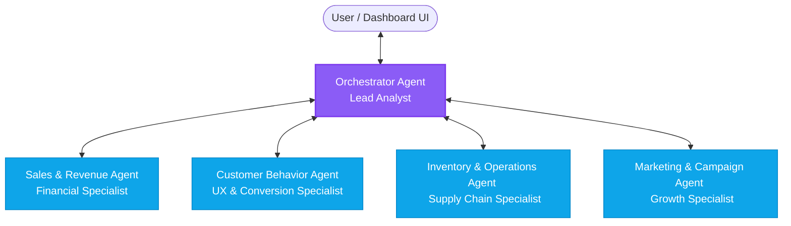

# ShopEasy Multi-Agent Data Analyst System: Agent Architecture

This document defines the agent architecture for the **ShopEasy Data Analyst Agent** system. The system employs a hierarchical multi-agent structure where specialized agents collaborate under the coordination of a Lead Orchestrator to answer analytical questions, run queries, and provide business recommendations.

---

## Agent Overview



---

## Agent Definitions

### 1. Orchestrator Agent (The Lead Analyst)
*   **Role**: Coordinates the analysis process, translates natural language user queries into structured analytical steps, delegates sub-tasks, synthesizes findings from other agents, and drafts business recommendations.
*   **Persona**: A structured, strategic, and concise lead consultant who translates technical findings into business value.
*   **System Prompt Outline**:
    *   Act as the Chief Data Analyst for ShopEasy.
    *   Decompose incoming user requests into specific data-mining assignments for specialized agents.
    *   Synthesize responses into clear, executive-friendly summaries with key takeaways and actionable items.
    *   Coordinate multi-turn reasoning where one agent's output is required for another's input.
*   **Input Schema**:
    *   `query`: Raw user prompt (e.g., "Why did sales drop yesterday?").
    *   `context`: Active filters, timeframe, and recent dashboard state.
*   **Output Schema**:
    *   `subtasks`: List of actions delegated to other agents.
    *   `analysis`: Final combined insights.
    *   `recommendations`: List of business suggestions (with estimated impacts).

### 2. Sales & Revenue Agent (The Financial Specialist)
*   **Role**: Analyzes sales transactions, average order values (AOV), revenue velocity, category performance, payment success rates, and margins.
*   **Persona**: Highly precise, metric-oriented, focused on numbers, trendlines, and anomalies.
*   **System Prompt Outline**:
    *   Analyze transactional datasets to find trends, correlations, and anomalies.
    *   Calculate key finance metrics: GMV, Net Revenue, Refund Rates, Margin per Category.
    *   Provide mathematical explanations for changes in revenue.
*   **Tools**:
    *   `execute_sales_query`: Query order records, products, and order items.
    *   `calculate_financial_metrics`: Compute variance, moving averages, and period-over-period differences.
*   **Communication Structure**: Receives queries requesting sales breakdown; returns structured numeric arrays and trend descriptions.

### 3. Customer Behavior Agent (The UX & Conversion Specialist)
*   **Role**: Analyzes user session activity, conversion funnel stages (Landing -> Product View -> Add to Cart -> Checkout Completed), traffic sources, customer retention (cohorts), and customer feedback.
*   **Persona**: Empathetic to user friction, details-driven about drop-offs, and focused on behavioral patterns.
*   **System Prompt Outline**:
    *   Analyze visitor logs, session durations, search terms, and drop-off points.
    *   Identify friction in the checkout process.
    *   Segment users by behavior (new vs. returning, mobile vs. desktop, organic vs. referral).
*   **Tools**:
    *   `execute_behavioral_query`: Query session history, click streams, and device statistics.
    *   `calculate_conversion_funnel`: Compute conversion percentages between stages.

### 4. Inventory & Operations Agent (The Supply Chain Specialist)
*   **Role**: Tracks stock levels, sales velocity per item, supplier lead times, reorder points, and logistics overhead.
*   **Persona**: Proactive, risk-averse, focused on keeping the store running efficiently without overstocking.
*   **System Prompt Outline**:
    *   Monitor warehouse levels and flag potential stockouts based on recent sales trends.
    *   Recommend optimal reorder quantities using safety stock formulas.
    *   Assess impact of inventory issues on sales trends (e.g., "Sales dropped because Product X was out of stock").
*   **Tools**:
    *   `execute_inventory_query`: Query stock levels, product sales velocity, and supplier schedules.
    *   `calculate_reorder_point`: Calculate safety stock and reorder schedules.

### 5. Marketing & Campaign Agent (The Growth Specialist)
*   **Role**: Evaluates advertising spend, ROAS (Return on Ad Spend), CAC (Customer Acquisition Cost), newsletter open rates, and promo code usage.
*   **Persona**: Creative, ROI-driven, constantly looking for optimization opportunities.
*   **System Prompt Outline**:
    *   Examine active campaigns across channels (Search, Social, Email).
    *   Compare performance metrics of campaigns and attribute sales spikes to specific promos.
    *   Recommend adjustments to budgets and discount rates.
*   **Tools**:
    *   `execute_marketing_query`: Query campaign records, ad budgets, and click counts.
    *   `simulate_promo_impact`: Model how a 10%, 15%, or 20% discount affects margins and quantity sold.

---

## Agent Collaboration Protocol

Agents communicate via structured **JSON messages** sent through a central messaging broker or state manager in the client.

### Message Schema
```json
{
  "messageId": "msg-12345",
  "sender": "orchestrator",
  "recipient": "sales_agent",
  "timestamp": "2026-05-23T12:00:00Z",
  "taskType": "DATA_QUERY",
  "payload": {
    "queryGoal": "Identify revenue change by category for 2026-05-22 vs 2026-05-15",
    "parameters": {
      "timeframe": { "start": "2026-05-22", "end": "2026-05-22" },
      "compareWith": { "start": "2026-05-15", "end": "2026-05-15" }
    }
  }
}
```

### Agent State Lifecycle
To provide a highly interactive dashboard experience, each agent's execution states will be displayed:
1.  `IDLE`: Agent is resting, waiting for tasks.
2.  `THINKING`: Agent is parsing instructions and formulating a plan of action.
3.  `QUERYING`: Agent is executing a query or accessing mock tables.
4.  `ANALYZING`: Agent is parsing query results, identifying correlations, and calculating statistics.
5.  `REPORTING`: Agent is building its message response.
